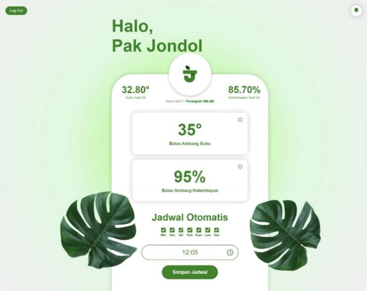
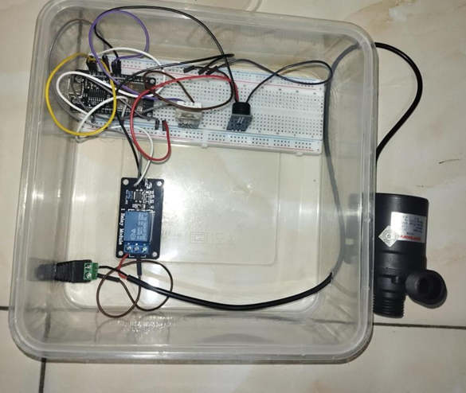
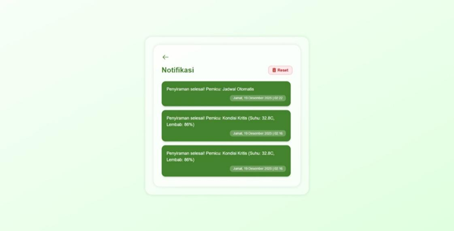

# 🌱 Kebun Pintar - Jondol Tani Lelea (IoT Smart Garden)


**Kebun Pintar Jondol Tani** adalah sistem monitoring dan penyiraman otomatis berbasis *Internet of Things* (IoT). Proyek ini dikembangkan untuk memantau kondisi lingkungan tanaman (Suhu & Kelembapan) secara *real-time* serta mengendalikan pompa air berdasarkan logika sensor atau jadwal yang ditentukan.

Dibangun menggunakan **Laravel 12** sebagai antarmuka web dan mikrokontroler **ESP32** sebagai pengendali perangkat keras.

---

## 📸 Antarmuka & Dokumentasi

### 1. Dashboard Monitoring
Memantau kondisi tanaman secara real-time dengan indikator status perangkat (Online/Offline).


### 2. Implementasi Hardware
Rangkaian ESP32, Sensor DHT22, Relay, dan Pompa dalam wadah proteksi.


### 3. Fitur Kontrol & Notifikasi
Pengaturan ambang batas (*threshold*), jadwal mingguan, dan riwayat penyiraman.
| Modal Setting Threshold | Notifikasi & Riwayat |
|:-----------------------:|:--------------------:|
|  |  |

---

## 🔥 Fitur Utama

### 🌐 Web System (Laravel 12)
- **Real-time Monitoring:** Data suhu dan kelembapan diperbarui setiap detik via protokol MQTT/HTTP.
- **Auto-Detection Status:** Sistem mendeteksi otomatis jika alat mati/putus koneksi (Indikator Offline).
- **Flexible Threshold:** Pengguna bisa mengubah batas pemicu (Suhu Panas / Tanah Kering) langsung dari web tanpa coding ulang.
- **Smart Scheduling:** Jadwal penyiraman otomatis berbasis hari dan jam.
- **Log History:** Mencatat setiap aktivitas penyiraman beserta pemicunya (Sensor/Jadwal) dengan fitur *Reset Data*.

### 🤖 Hardware Logic (ESP32)
- **Compound Logic:** Penyiraman otomatis hanya terjadi jika kondisi Kritis (**Suhu > Batas** DAN **Lembab < Batas**).
- **State Memory:** Mengingat penyebab penyiraman terakhir untuk pelaporan data yang akurat.
- **Fail-Safe Timer:** Proteksi durasi penyiraman agar pompa tidak menyala terus-menerus.
- **Local Alert:** Buzzer berbunyi saat penyiraman aktif sebagai indikator fisik.

---

## 🛠️ Spesifikasi Teknis

### Perangkat Lunak (*Software Stack*)
- **Framework:** Laravel 12 (PHP 8.2+)
- **Database:** MySQL / MariaDB
- **Frontend:** Blade Templating, Tailwind CSS, Vite
- **Server:** Apache/Nginx (Support Hosting aaPanel/cPanel)

### Perangkat Keras (*Hardware Pinout*)
Mapping pin pada **ESP32 DevKit V1**:

| Komponen | Tipe | Pin GPIO | Keterangan |
| :--- | :--- | :--- | :--- |
| **DHT22** | Input | `GPIO 26` | Sensor Suhu & Kelembapan |
| **Relay Module** | Output | `GPIO 14` | Trigger Pompa Air (Active Low) |
| **Buzzer** | Output | `GPIO 25` | Alarm Notifikasi |

---

## 🚀 Cara Instalasi (Web Server)

Ikuti langkah ini untuk menjalankan server lokal:

1. **Clone Repository**
   ```bash
   git clone https://github.com/Lesmana24/Proyek2
   cd kebun-pintar-jondol
   ```

2. **Install Dependencies**
    ```bash
    composer install
    npm install
    ```

3. **Konfigurasi Environment Salin file .env dan sesuaikan database.**
    ```bash
    cp .env.example .env
    php artisan key:generate
    ```
Edit .env bagian DB_DATABASE, DB_USERNAME, DB_PASSWORD.

4. **Build Assets**
    ```bash
    npm run build
    ```

5. **Migrasi Database**
    ```bash
    php artisan migrate
    ```

6. **Jalankan Server**
    ```bash
    php artisan serve
    ```
Akses di: http://localhost:8000

---

## 🔌 Implementasi Hardware (ESP32 Firmware)

Kode sumber lengkap (Full Code) dapat dilihat di folder [`/hardware`](./hardware).

### ✨ Fitur Unggulan Firmware
1.  **Dynamic WiFi Connect (`WiFiManager`):** Tidak perlu *hardcode* SSID/Password di kodingan. Jika gagal konek, alat akan membuat Hotspot untuk konfigurasi ulang via HP.
2.  **OTA Control (MQTT):** Menerima perintah *threshold* dan jadwal baru secara *real-time* tanpa restart.
3.  **Fail-Safe Logic:** Sistem proteksi pompa otomatis mati jika koneksi terputus atau timer habis.
4.  **Dual Protocol:** Menggunakan **MQTT** untuk kontrol cepat dan **HTTP POST** untuk pelaporan data ke Laravel.

### ⚙️ Konfigurasi Awal
Sebelum upload, pastikan Library berikut terinstall di Arduino IDE:
- `WiFiManager` by tzapu
- `PubSubClient` (MQTT)
- `DHT sensor library`
- `Adafruit Unified Sensor`

### 📝 Snippet Konfigurasi
Sesuaikan variabel server di file `.ino` jika menggunakan hosting berbeda:

```cpp
// === KONFIGURASI API LARAVEL ===
// Ganti dengan domain hosting kamu
String serverName = "[https://proyek1d2.proyek.jti.polindra.ac.id/api/simpan-notif](https://proyek1d2.proyek.jti.polindra.ac.id/api/simpan-notif)";

// === MQTT BROKER ===
const char* mqtt_server = "broker.emqx.io";
```

🚀 Cara Setting WiFi Pertama Kali (Tanpa Coding)
1. Karena menggunakan WiFiManager, saat alat pertama kali dinyalakan di tempat baru:
2. Alat akan menyebarkan Hotspot bernama IoT-Penyiraman-Config.
3. Konek ke WiFi tersebut menggunakan HP/Laptop.
4. Otomatis akan muncul halaman "Configure WiFi".
5. Pilih WiFi yang tersedia (misal: WiFi Kampus/Rumah) dan masukkan Password.
6. Klik Save, alat akan restart dan otomatis terhubung.
7. Untuk mereset WiFi: Tekan tombol BOOT (Pin 0) pada ESP32.

👨‍💻 Pengembang
Lesmana Adhi Kusuma
Mahasiswa D3 Teknik Informatika - Politeknik Negeri Indramayu (Polindra)

Mata Kuliah Proyek 2: Implementasi Laravel dan Integrasi dengan IoT
